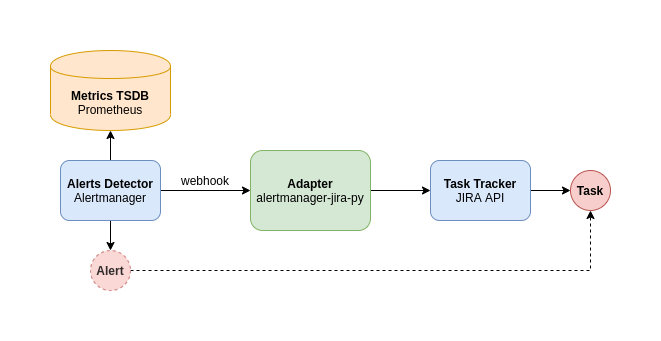

# Info

Adapter to transform Alertmanager events to Jira trackable tasks.



# Usage

Ready to run as a docker container:

```
docker build . -t agrrh/alertmanager-jira-py:1.0.0
docker run -ti -p 8080:8080 agrrh/alertmanager-jira-py:1.0.0
```

Then send your Alertmanager webhooks to this adapter:

```
receivers:
  - name: "my-alert"
    slack_configs:
      ...
    webhook_configs:
      - url: http://127.0.0.1:8080/alert
```

## Logic summary

- Once alert is triggered, adapter will create new task in your Jira project

- If there's already Jira task created and both conditions satisfied:
  - task closed with any but `resolution_wontfix` resolution
  - task newer than `issues_updated_in` time

  ... then adapter will re-open same task instead of creating new one.

## Testing

One could run tests with following alert data examples:

```
# Firing
http POST 0.0.0.0:5000/alert < samples/firing.json

# Resolved
http POST 0.0.0.0:5000/alert < samples/resolved.json

# Multiple
http POST 0.0.0.0:5000/alert < samples/multiple.json
```

# Alternatives

- https://github.com/free/jiralert - Golang, it inspired my implementation
- https://github.com/fabxc/jiralerts - Python, less flexible IMO
