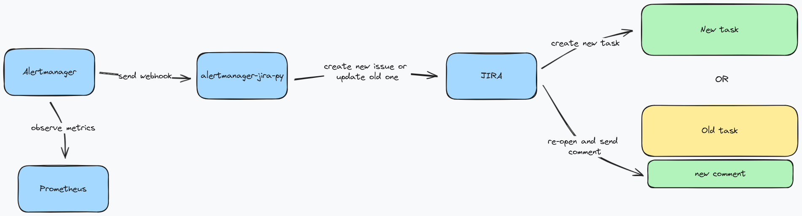

# Info

Adapter to transform Alertmanager events to Jira trackable tasks.



# Usage

Run a service:

```
docker build . -t alertmanager-jira-py
docker run -ti -p 8080:8080 alertmanager-jira-py
```

Then send your Alertmanager webhooks to this adapter:

```
receivers:
  - name: "my-alert"
    slack_configs:
      ...
    webhook_configs:
      - url: http://127.0.0.1:8080/alert
```

That's how it works.

## Logic summary

- Once alert is triggered, adapter will create new task in your Jira project

- If there's already Jira task created and both conditions satisfied:
  - task closed with any but `resolution_wontfix` resolution
  - task newer than `issues_updated_in` time

  Then adapter will re-open same task instead of creating new one

## Testing

One could run tests with following alert data examples:

```
# Firing
http POST 0.0.0.0:5000/alert < samples/firing.json

# Resolved
http POST 0.0.0.0:5000/alert < samples/resolved.json

# Multiple
http POST 0.0.0.0:5000/alert < samples/multiple.json
```
